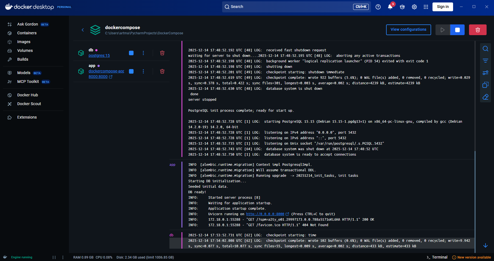
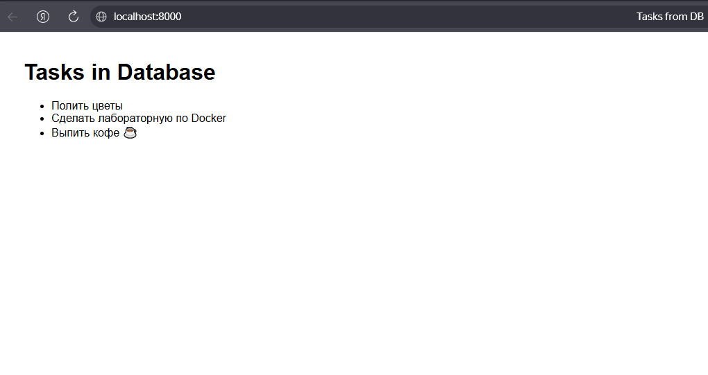

# FastAPI + PostgreSQL — Пример веб-приложения с Docker

Это минимальное веб-приложение на FastAPI, которое:

Подключается к базе данных PostgreSQL (запущенной в отдельном Docker-контейнере);
При старте автоматически применяет миграции с помощью Alembic;
Загружает начальные демо-данные (список задач);
Отображает эти данные на главной странице.

Все миграции и начальные данные применяются автоматически при запуске контейнера app — вручную ничего делать не нужно.

Папка проекта монтируется в контейнер, поэтому изменения в коде (кроме зависимостей) подхватываются без пересборки.
Файл alembic.ini должен быть валидным INI-файлом с секцией [alembic] — иначе возникнет ошибка MissingSectionHeaderError.
В проекте используется Jinja2 для рендеринга HTML-шаблонов

```bash
PS C:\Users\artma\PycharmProjects\DockerCompose> docker-compose down -v
[+] Running 4/4r Desktop   o View Config   w Enable Watch
 ✔ Container dockercompose-app-1       Removed                                                                     0.1s
 ✔ Container dockercompose-db-1        Removed                                                                     0.0s
 ✔ Network dockercompose_default       Removed                                                                     0.5s
 ✔ Volume dockercompose_postgres_data  Removed                                                                     0.0s
PS C:\Users\artma\PycharmProjects\DockerCompose> docker-compose build
#1 [internal] load local bake definitions
#1 reading from stdin 550B 0.0s done
#1 DONE 0.0s

#2 [internal] load build definition from Dockerfile
#2 transferring dockerfile: 482B done
#2 DONE 0.0s

#3 [internal] load metadata for docker.io/library/python:3.11-slim
#3 DONE 1.0s

#4 [internal] load .dockerignore
#4 transferring context: 2B done
#4 DONE 0.0s

#5 [1/6] FROM docker.io/library/python:3.11-slim@sha256:158caf0e080e2cd74ef2879ed3c4e697792ee65251c8208b7afb56683c32ea6c
#5 DONE 0.0s

#6 [internal] load build context
#6 transferring context: 1.42MB 0.3s done
#6 DONE 0.3s

#7 [2/6] WORKDIR /app
#7 CACHED

#8 [3/6] RUN apt-get update && apt-get install -y --no-install-recommends     gcc libpq-dev     && rm -rf /var/lib/apt/lists/*
#8 CACHED

#9 [4/6] COPY requirements.txt .
#9 DONE 0.1s

#10 [5/6] RUN pip install --no-cache-dir -r requirements.txt
#10 2.352 Collecting fastapi==0.115.0 (from -r requirements.txt (line 1))
#10 2.597   Downloading fastapi-0.115.0-py3-none-any.whl.metadata (27 kB)
#10 2.716 Collecting uvicorn==0.32.0 (from uvicorn[standard]==0.32.0->-r requirements.txt (line 2))
#10 2.793   Downloading uvicorn-0.32.0-py3-none-any.whl.metadata (6.6 kB)
#10 3.335 Collecting sqlalchemy==2.0.35 (from -r requirements.txt (line 3))
#10 3.416   Downloading SQLAlchemy-2.0.35-cp311-cp311-manylinux_2_17_x86_64.manylinux2014_x86_64.whl.metadata (9.6 kB)
#10 3.667 Collecting psycopg2-binary==2.9.10 (from -r requirements.txt (line 4))
#10 3.754   Downloading psycopg2_binary-2.9.10-cp311-cp311-manylinux_2_17_x86_64.manylinux2014_x86_64.whl.metadata (4.9 kB)
#10 3.883 Collecting alembic==1.13.3 (from -r requirements.txt (line 5))
#10 3.958   Downloading alembic-1.13.3-py3-none-any.whl.metadata (7.4 kB)
#10 4.057 Collecting jinja2==3.1.4 (from -r requirements.txt (line 6))
#10 4.131   Downloading jinja2-3.1.4-py3-none-any.whl.metadata (2.6 kB)
#10 4.295 Collecting starlette<0.39.0,>=0.37.2 (from fastapi==0.115.0->-r requirements.txt (line 1))
#10 4.371   Downloading starlette-0.38.6-py3-none-any.whl.metadata (6.0 kB)
#10 4.745 Collecting pydantic!=1.8,!=1.8.1,!=2.0.0,!=2.0.1,!=2.1.0,<3.0.0,>=1.7.4 (from fastapi==0.115.0->-r requirements.txt (line 1))
#10 4.839   Downloading pydantic-2.12.5-py3-none-any.whl.metadata (90 kB)
#10 4.862      ━━━━━━━━━━━━━━━━━━━━━━━━━━━━━━━━━━━━━━━━ 90.6/90.6 kB 4.1 MB/s eta 0:00:00
#10 4.962 Collecting typing-extensions>=4.8.0 (from fastapi==0.115.0->-r requirements.txt (line 1))
#10 5.033   Downloading typing_extensions-4.15.0-py3-none-any.whl.metadata (3.3 kB)
#10 5.142 Collecting click>=7.0 (from uvicorn==0.32.0->uvicorn[standard]==0.32.0->-r requirements.txt (line 2))
#10 5.216   Downloading click-8.3.1-py3-none-any.whl.metadata (2.6 kB)
#10 5.299 Collecting h11>=0.8 (from uvicorn==0.32.0->uvicorn[standard]==0.32.0->-r requirements.txt (line 2))
#10 5.373   Downloading h11-0.16.0-py3-none-any.whl.metadata (8.3 kB)
#10 5.745 Collecting greenlet!=0.4.17 (from sqlalchemy==2.0.35->-r requirements.txt (line 3))
#10 5.818   Downloading greenlet-3.3.0-cp311-cp311-manylinux_2_24_x86_64.manylinux_2_28_x86_64.whl.metadata (4.1 kB)
#10 5.939 Collecting Mako (from alembic==1.13.3->-r requirements.txt (line 5))
#10 6.009   Downloading mako-1.3.10-py3-none-any.whl.metadata (2.9 kB)
#10 6.179 Collecting MarkupSafe>=2.0 (from jinja2==3.1.4->-r requirements.txt (line 6))
#10 6.251   Downloading markupsafe-3.0.3-cp311-cp311-manylinux2014_x86_64.manylinux_2_17_x86_64.manylinux_2_28_x86_64.whl.metadata (2.7 kB)
#10 6.394 Collecting httptools>=0.5.0 (from uvicorn[standard]==0.32.0->-r requirements.txt (line 2))
#10 6.469   Downloading httptools-0.7.1-cp311-cp311-manylinux1_x86_64.manylinux_2_28_x86_64.manylinux_2_5_x86_64.whl.metadata (3.5 kB)
#10 6.560 Collecting python-dotenv>=0.13 (from uvicorn[standard]==0.32.0->-r requirements.txt (line 2))
#10 6.639   Downloading python_dotenv-1.2.1-py3-none-any.whl.metadata (25 kB)
#10 6.798 Collecting pyyaml>=5.1 (from uvicorn[standard]==0.32.0->-r requirements.txt (line 2))
#10 6.874   Downloading pyyaml-6.0.3-cp311-cp311-manylinux2014_x86_64.manylinux_2_17_x86_64.manylinux_2_28_x86_64.whl.metadata (2.4 kB)
#10 7.015 Collecting uvloop!=0.15.0,!=0.15.1,>=0.14.0 (from uvicorn[standard]==0.32.0->-r requirements.txt (line 2))
#10 7.092   Downloading uvloop-0.22.1-cp311-cp311-manylinux2014_x86_64.manylinux_2_17_x86_64.manylinux_2_28_x86_64.whl.metadata (4.9 kB)
#10 7.343 Collecting watchfiles>=0.13 (from uvicorn[standard]==0.32.0->-r requirements.txt (line 2))
#10 7.418   Downloading watchfiles-1.1.1-cp311-cp311-manylinux_2_17_x86_64.manylinux2014_x86_64.whl.metadata (4.9 kB)
#10 7.688 Collecting websockets>=10.4 (from uvicorn[standard]==0.32.0->-r requirements.txt (line 2))
#10 7.769   Downloading websockets-15.0.1-cp311-cp311-manylinux_2_5_x86_64.manylinux1_x86_64.manylinux_2_17_x86_64.manylinux2014_x86_64.whl.metadata (6.8 kB)
#10 7.866 Collecting annotated-types>=0.6.0 (from pydantic!=1.8,!=1.8.1,!=2.0.0,!=2.0.1,!=2.1.0,<3.0.0,>=1.7.4->fastapi==0.115.0->-r requirements.txt (line 1))
#10 7.940   Downloading annotated_types-0.7.0-py3-none-any.whl.metadata (15 kB)
#10 9.029 Collecting pydantic-core==2.41.5 (from pydantic!=1.8,!=1.8.1,!=2.0.0,!=2.0.1,!=2.1.0,<3.0.0,>=1.7.4->fastapi==0.115.0->-r requirements.txt (line 1))
#10 9.100   Downloading pydantic_core-2.41.5-cp311-cp311-manylinux_2_17_x86_64.manylinux2014_x86_64.whl.metadata (7.3 kB)
#10 9.204 Collecting typing-inspection>=0.4.2 (from pydantic!=1.8,!=1.8.1,!=2.0.0,!=2.0.1,!=2.1.0,<3.0.0,>=1.7.4->fastapi==0.115.0->-r requirements.txt (line 1))
#10 9.273   Downloading typing_inspection-0.4.2-py3-none-any.whl.metadata (2.6 kB)
#10 9.383 Collecting anyio<5,>=3.4.0 (from starlette<0.39.0,>=0.37.2->fastapi==0.115.0->-r requirements.txt (line 1))
#10 9.452   Downloading anyio-4.12.0-py3-none-any.whl.metadata (4.3 kB)
#10 9.577 Collecting idna>=2.8 (from anyio<5,>=3.4.0->starlette<0.39.0,>=0.37.2->fastapi==0.115.0->-r requirements.txt (line 1))
#10 9.651   Downloading idna-3.11-py3-none-any.whl.metadata (8.4 kB)
#10 9.761 Downloading fastapi-0.115.0-py3-none-any.whl (94 kB)
#10 9.774    ━━━━━━━━━━━━━━━━━━━━━━━━━━━━━━━━━━━━━━━━ 94.6/94.6 kB 30.4 MB/s eta 0:00:00
#10 9.846 Downloading uvicorn-0.32.0-py3-none-any.whl (63 kB)
#10 9.853    ━━━━━━━━━━━━━━━━━━━━━━━━━━━━━━━━━━━━━━━━ 63.7/63.7 kB 24.6 MB/s eta 0:00:00
#10 9.934 Downloading SQLAlchemy-2.0.35-cp311-cp311-manylinux_2_17_x86_64.manylinux2014_x86_64.whl (3.2 MB)
#10 10.22    ━━━━━━━━━━━━━━━━━━━━━━━━━━━━━━━━━━━━━━━━ 3.2/3.2 MB 11.2 MB/s eta 0:00:00
#10 10.30 Downloading psycopg2_binary-2.9.10-cp311-cp311-manylinux_2_17_x86_64.manylinux2014_x86_64.whl (3.0 MB)
#10 10.56    ━━━━━━━━━━━━━━━━━━━━━━━━━━━━━━━━━━━━━━━━ 3.0/3.0 MB 11.8 MB/s eta 0:00:00
#10 10.63 Downloading alembic-1.13.3-py3-none-any.whl (233 kB)
#10 10.66    ━━━━━━━━━━━━━━━━━━━━━━━━━━━━━━━━━━━━━━━━ 233.2/233.2 kB 14.7 MB/s eta 0:00:00
#10 10.73 Downloading jinja2-3.1.4-py3-none-any.whl (133 kB)
#10 10.74    ━━━━━━━━━━━━━━━━━━━━━━━━━━━━━━━━━━━━━━━━ 133.3/133.3 kB 11.1 MB/s eta 0:00:00
#10 10.81 Downloading click-8.3.1-py3-none-any.whl (108 kB)
#10 10.82    ━━━━━━━━━━━━━━━━━━━━━━━━━━━━━━━━━━━━━━━━ 108.3/108.3 kB 15.1 MB/s eta 0:00:00
#10 10.89 Downloading greenlet-3.3.0-cp311-cp311-manylinux_2_24_x86_64.manylinux_2_28_x86_64.whl (590 kB)
#10 10.95    ━━━━━━━━━━━━━━━━━━━━━━━━━━━━━━━━━━━━━━━━ 590.2/590.2 kB 13.1 MB/s eta 0:00:00
#10 11.02 Downloading h11-0.16.0-py3-none-any.whl (37 kB)
#10 11.11 Downloading httptools-0.7.1-cp311-cp311-manylinux1_x86_64.manylinux_2_28_x86_64.manylinux_2_5_x86_64.whl (456 kB)
#10 11.15    ━━━━━━━━━━━━━━━━━━━━━━━━━━━━━━━━━━━━━━━━ 456.6/456.6 kB 12.3 MB/s eta 0:00:00
#10 11.23 Downloading markupsafe-3.0.3-cp311-cp311-manylinux2014_x86_64.manylinux_2_17_x86_64.manylinux_2_28_x86_64.whl (22 kB)
#10 11.30 Downloading pydantic-2.12.5-py3-none-any.whl (463 kB)
#10 11.35    ━━━━━━━━━━━━━━━━━━━━━━━━━━━━━━━━━━━━━━━━ 463.6/463.6 kB 13.0 MB/s eta 0:00:00
#10 11.43 Downloading pydantic_core-2.41.5-cp311-cp311-manylinux_2_17_x86_64.manylinux2014_x86_64.whl (2.1 MB)
#10 11.61    ━━━━━━━━━━━━━━━━━━━━━━━━━━━━━━━━━━━━━━━━ 2.1/2.1 MB 11.3 MB/s eta 0:00:00
#10 11.68 Downloading python_dotenv-1.2.1-py3-none-any.whl (21 kB)
#10 11.77 Downloading pyyaml-6.0.3-cp311-cp311-manylinux2014_x86_64.manylinux_2_17_x86_64.manylinux_2_28_x86_64.whl (806 kB)
#10 11.84    ━━━━━━━━━━━━━━━━━━━━━━━━━━━━━━━━━━━━━━━━ 806.6/806.6 kB 12.8 MB/s eta 0:00:00
#10 11.91 Downloading starlette-0.38.6-py3-none-any.whl (71 kB)
#10 11.92    ━━━━━━━━━━━━━━━━━━━━━━━━━━━━━━━━━━━━━━━━ 71.5/71.5 kB 15.3 MB/s eta 0:00:00
#10 11.99 Downloading typing_extensions-4.15.0-py3-none-any.whl (44 kB)
#10 11.99    ━━━━━━━━━━━━━━━━━━━━━━━━━━━━━━━━━━━━━━━━ 44.6/44.6 kB 229.9 MB/s eta 0:00:00
#10 12.08 Downloading uvloop-0.22.1-cp311-cp311-manylinux2014_x86_64.manylinux_2_17_x86_64.manylinux_2_28_x86_64.whl (3.8 MB)
#10 12.43    ━━━━━━━━━━━━━━━━━━━━━━━━━━━━━━━━━━━━━━━━ 3.8/3.8 MB 10.8 MB/s eta 0:00:00
#10 12.50 Downloading watchfiles-1.1.1-cp311-cp311-manylinux_2_17_x86_64.manylinux2014_x86_64.whl (456 kB)
#10 12.54    ━━━━━━━━━━━━━━━━━━━━━━━━━━━━━━━━━━━━━━━━ 456.1/456.1 kB 13.7 MB/s eta 0:00:00
#10 12.62 Downloading websockets-15.0.1-cp311-cp311-manylinux_2_5_x86_64.manylinux1_x86_64.manylinux_2_17_x86_64.manylinux2014_x86_64.whl (182 kB)
#10 12.63    ━━━━━━━━━━━━━━━━━━━━━━━━━━━━━━━━━━━━━━━━ 182.3/182.3 kB 15.1 MB/s eta 0:00:00
#10 12.71 Downloading mako-1.3.10-py3-none-any.whl (78 kB)
#10 12.72    ━━━━━━━━━━━━━━━━━━━━━━━━━━━━━━━━━━━━━━━━ 78.5/78.5 kB 8.3 MB/s eta 0:00:00
#10 12.80 Downloading annotated_types-0.7.0-py3-none-any.whl (13 kB)
#10 12.87 Downloading anyio-4.12.0-py3-none-any.whl (113 kB)
#10 12.88    ━━━━━━━━━━━━━━━━━━━━━━━━━━━━━━━━━━━━━━━━ 113.4/113.4 kB 21.1 MB/s eta 0:00:00
#10 12.95 Downloading typing_inspection-0.4.2-py3-none-any.whl (14 kB)
#10 13.02 Downloading idna-3.11-py3-none-any.whl (71 kB)
#10 13.03    ━━━━━━━━━━━━━━━━━━━━━━━━━━━━━━━━━━━━━━━━ 71.0/71.0 kB 12.4 MB/s eta 0:00:00
#10 13.28 Installing collected packages: websockets, uvloop, typing-extensions, pyyaml, python-dotenv, psycopg2-binary, MarkupSafe, idna, httptools, h11, greenlet, click, annotated-types, uvicorn, typing-inspection, sqlalchemy, pydantic-core, Mako, jinja2, anyio, watchfiles, starlette, pydantic, alembic, fastapi
#10 16.53 Successfully installed Mako-1.3.10 MarkupSafe-3.0.3 alembic-1.13.3 annotated-types-0.7.0 anyio-4.12.0 click-8.3.1 fastapi-0.115.0 greenlet-3.3.0 h11-0.16.0 httptools-0.7.1 idna-3.11 jinja2-3.1.4 psycopg2-binary-2.9.10 pydantic-2.12.5 pydantic-core-2.41.5 python-dotenv-1.2.1 pyyaml-6.0.3 sqlalchemy-2.0.35 starlette-0.38.6 typing-extensions-4.15.0 typing-inspection-0.4.2 uvicorn-0.32.0 uvloop-0.22.1 watchfiles-1.1.1 websockets-15.0.1
#10 16.53 WARNING: Running pip as the 'root' user can result in broken permissions and conflicting behaviour with the system package manager. It is recommended to use a virtual environment instead: https://pip.pypa.io/warnings/venv
#10 16.84
#10 16.84 [notice] A new release of pip is available: 24.0 -> 25.3
#10 16.84 [notice] To update, run: pip install --upgrade pip
#10 DONE 17.3s

#11 [6/6] COPY . .
#11 DONE 1.3s

#12 exporting to image
#12 exporting layers
#12 exporting layers 0.6s done
#12 writing image sha256:a10a4daf1dae1987cacf1e67014578e4e350d644af1865d6365e5cf91e513a2c done
#12 naming to docker.io/library/dockercompose-app done
#12 DONE 0.6s

#13 resolving provenance for metadata file
#13 DONE 0.0s
[+] Building 1/1
 ✔ dockercompose-app  Built                                                                                        0.0s
PS C:\Users\artma\PycharmProjects\DockerCompose> docker-compose up
[+] Running 4/4
 ✔ Network dockercompose_default         Created                                                                   0.1s
 ✔ Volume "dockercompose_postgres_data"  Created                                                                   0.0s
 ✔ Container dockercompose-db-1          Created                                                                   0.1s
 ✔ Container dockercompose-app-1         Created                                                                   0.1s
Attaching to app-1, db-1
db-1  | The files belonging to this database system will be owned by user "postgres".
db-1  | This user must also own the server process.
db-1  |
db-1  | The database cluster will be initialized with locale "en_US.utf8".
db-1  | The default database encoding has accordingly been set to "UTF8".
db-1  | The default text search configuration will be set to "english".
db-1  |
db-1  | Data page checksums are disabled.
db-1  |
db-1  | fixing permissions on existing directory /var/lib/postgresql/data ... ok
db-1  | creating subdirectories ... ok
db-1  | selecting dynamic shared memory implementation ... posix
db-1  | selecting default max_connections ... 100
db-1  | selecting default shared_buffers ... 128MB
db-1  | selecting default time zone ... Etc/UTC
db-1  | creating configuration files ... ok
db-1  | running bootstrap script ... ok
db-1  | performing post-bootstrap initialization ... ok
db-1  | initdb: warning: enabling "trust" authentication for local connections
db-1  | initdb: hint: You can change this by editing pg_hba.conf or using the option -A, or --auth-local and --auth-host, the next time you run initdb.
db-1  | syncing data to disk ... ok
db-1  |
db-1  |
db-1  | Success. You can now start the database server using:
db-1  |
db-1  |     pg_ctl -D /var/lib/postgresql/data -l logfile start
db-1  |
db-1  | waiting for server to start....2025-12-14 17:48:51.984 UTC [48] LOG:  starting PostgreSQL 15.15 (Debian 15.15-1.pgdg13+1) on x86_64-pc-linux-gnu, compiled by gcc (Debian 14.2.0-19) 14.2.0, 64-bit
db-1  | 2025-12-14 17:48:51.990 UTC [48] LOG:  listening on Unix socket "/var/run/postgresql/.s.PGSQL.5432"
db-1  | 2025-12-14 17:48:52.001 UTC [51] LOG:  database system was shut down at 2025-12-14 17:48:50 UTC
db-1  | 2025-12-14 17:48:52.009 UTC [48] LOG:  database system is ready to accept connections
db-1  |  done
db-1  | server started
db-1  | CREATE DATABASE
db-1  |
db-1  |
db-1  | /usr/local/bin/docker-entrypoint.sh: ignoring /docker-entrypoint-initdb.d/*
db-1  |
db-1  | 2025-12-14 17:48:52.192 UTC [48] LOG:  received fast shutdown request
db-1  | waiting for server to shut down....2025-12-14 17:48:52.195 UTC [48] LOG:  aborting any active transactions
db-1  | 2025-12-14 17:48:52.198 UTC [48] LOG:  background worker "logical replication launcher" (PID 54) exited with exit code 1
db-1  | 2025-12-14 17:48:52.198 UTC [49] LOG:  shutting down
db-1  | 2025-12-14 17:48:52.201 UTC [49] LOG:  checkpoint starting: shutdown immediate
db-1  | 2025-12-14 17:48:52.619 UTC [49] LOG:  checkpoint complete: wrote 922 buffers (5.6%); 0 WAL file(s) added, 0 removed, 0 recycled; write=0.029 s, sync=0.378 s, total=0.422 s; sync files=301, longest=0.003 s, average=0.002 s; distance=4239 kB, estimate=4239 kB
db-1  | 2025-12-14 17:48:52.630 UTC [48] LOG:  database system is shut down
db-1  |  done
db-1  | server stopped
db-1  |
db-1  | PostgreSQL init process complete; ready for start up.
db-1  |
db-1  | 2025-12-14 17:48:52.728 UTC [1] LOG:  starting PostgreSQL 15.15 (Debian 15.15-1.pgdg13+1) on x86_64-pc-linux-gnu, compiled by gcc (Debian 14.2.0-19) 14.2.0, 64-bit
db-1  | 2025-12-14 17:48:52.728 UTC [1] LOG:  listening on IPv4 address "0.0.0.0", port 5432
db-1  | 2025-12-14 17:48:52.728 UTC [1] LOG:  listening on IPv6 address "::", port 5432
db-1  | 2025-12-14 17:48:52.735 UTC [1] LOG:  listening on Unix socket "/var/run/postgresql/.s.PGSQL.5432"
db-1  | 2025-12-14 17:48:52.743 UTC [64] LOG:  database system was shut down at 2025-12-14 17:48:52 UTC
db-1  | 2025-12-14 17:48:52.750 UTC [1] LOG:  database system is ready to accept connections
app-1  | INFO  [alembic.runtime.migration] Context impl PostgresqlImpl.
app-1  | INFO  [alembic.runtime.migration] Will assume transactional DDL.
app-1  | INFO  [alembic.runtime.migration] Running upgrade  -> 20251214_init_tasks, init tasks
app-1  | Starting DB initialization...
app-1  | Seeded initial data.
app-1  | DB ready!
app-1  | INFO:     Started server process [8]
app-1  | INFO:     Waiting for application startup.
app-1  | INFO:     Application startup complete.
app-1  | INFO:     Uvicorn running on http://0.0.0.0:8000 (Press CTRL+C to quit)
app-1  | INFO:     172.18.0.1:55288 - "GET /?spm=a2ty_o01.29997173.0.0.788a5171oKL6HA HTTP/1.1" 200 OK
app-1  | INFO:     172.18.0.1:55288 - "GET /favicon.ico HTTP/1.1" 404 Not Found
db-1   | 2025-12-14 17:53:52.731 UTC [62] LOG:  checkpoint starting: time
db-1   | 2025-12-14 17:54:02.808 UTC [62] LOG:  checkpoint complete: wrote 102 buffers (0.6%); 0 WAL file(s) added, 0 removed, 0 recycled; write=9.942 s, sync=0.077 s, total=10.077 s; sync files=55, longest=0.009 s, average=0.002 s; distance=433 kB, estimate=433 kB
```


DockerDesktop

Демонстрация работы